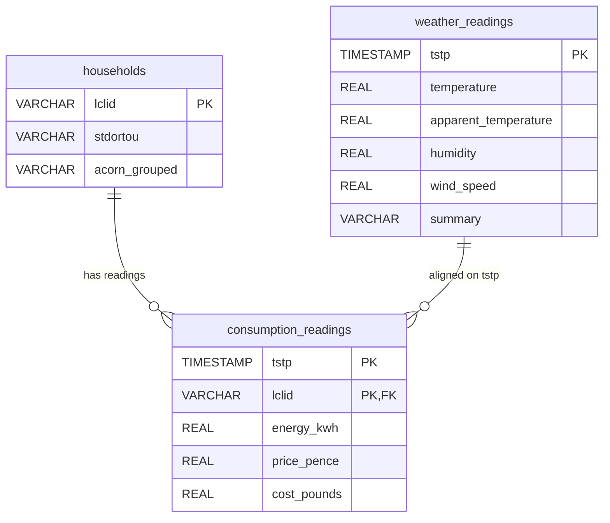

# Database Design & Migration Report (PostgreSQL/TimescaleDB)

This report documents the database schema design, optimization choices, and high-performance loading mechanics implemented for the **Volti** project (Sprint 2 - Reyyan's Task 2).

---

## 1. Relational & Time-Series Schema Architecture

To prevent data redundancy and optimize querying speeds, the processed smart meter dataset is normalized into **three distinct tables**:



### Table Definitions

1. **`households` (Dimension Table):**
   - Keeps demographic (ACORN) and tariff classification (`Std` vs `ToU`) for each household. Since this metadata is static, separating it avoids repeating string groupings on every half-hourly reading.
2. **`weather_readings` (Dimension Table):**
   - Stores half-hourly meteorologic metrics for London. Aligned by timestamp (`tstp`).
3. **`consumption_readings` (Zaman Serisi - Hypertable):**
   - The central transactional table containing chronological consumption (`energy_kwh`), pricing signals (`price_pence`), and calculated costs (`cost_pounds`). Uses a composite primary key `(LCLid, tstp)` to ensure uniqueness per household-timestamp.

---

## 2. TimescaleDB & Performance Indexing Strategy

### A. Automatic Partitioning (Hypertables)
For time-series tables containing millions of rows, writing and scanning speeds degrade over time as indexes grow too large for RAM. 
- **Action:** By executing `SELECT create_hypertable('consumption_readings', 'tstp')`, TimescaleDB partitions this massive table into smaller time-based chunks behind the scenes.
- **Benefit:** Chunks isolate write/read locks to the active time range, keeping active B-Tree indexes small enough to stay in memory (RAM).

### B. Indexing Strategy
To optimize the backend REST APIs (FastAPI) and simulation requests, we implement two indexing strategies:
1. **`idx_consumption_tstp` (on `tstp DESC`):** Optimizes global calculations, such as computing the total grid load for a specific day or hour.
2. **`idx_consumption_lclid_tstp` (on `(LCLid, tstp DESC)`):** A composite index to optimize household-level queries. When a user requests their dashboard (e.g., *"Show MAC000002's consumption history for the past week"*), the database retrieves the records in microseconds rather than scanning the entire table.

---

## 3. High-Performance Bulk Data Loader

Traditional `INSERT` commands execute one row at a time, taking hours for 6 million rows due to database roundtrips and transaction overhead.
- **Action:** In [load_data.py](Sprint%202/veritabani/load_data.py), we utilize the **PostgreSQL COPY protocol** through `cursor.copy_expert()` combined with an in-memory buffer (`io.StringIO`).
- **Mechanism:**
  1. The Python script reads a `.parquet` file into a Pandas DataFrame.
  2. The DataFrame is converted directly into an in-memory CSV/tab-delimited string stream in RAM.
  3. The stream is piped directly into the database in a single network stream, bypasses SQL parsing, and populates the table in bulk.
- **Benefit:** The load speed increases by **up to 100x**, executing migration for millions of rows in seconds.

---

## 4. Usage Instructions

### Step 1: Create Database and Tables
Ensure your local PostgreSQL/TimescaleDB service is running, create the database, and execute the SQL file:
```bash
# Log in to Postgres and create database
createdb -U postgres volti_db

# Create schema tables
psql -U postgres -d volti_db -f "Sprint 2/veritabani/schema.sql"
```

### Step 2: Migrate Parquet Data
Configure your connection credentials (using environment variables if different from defaults) and run the loader:
```bash
# Run loader (processes all parquet files in dataset/ folder)
python "Sprint 2/veritabani/load_data.py"
```
